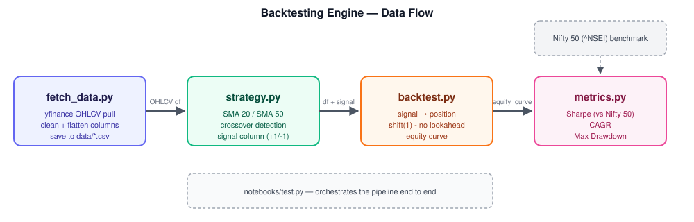

# Backtesting Engine

A Python backtesting engine for a moving-average crossover strategy on Indian equities, built from scratch — data pipeline, signal generation, position simulation, and performance analytics, benchmarked against the Nifty 50.

This project isn't just "does it run" — it's built around getting the mechanics *correct*: no lookahead bias, adjusted prices, and honest performance reporting including where the strategy fails.



## Project Structure

```
backtesting-engine/
├── data/                   # cached OHLCV pulls (gitignored)
├── docs/                   # diagrams / images used in this README
├── notebooks/
│   └── test.py             # orchestrates the full pipeline end-to-end
├── src/
│   ├── fetch_data.py       # yfinance data fetching + cleaning
│   ├── strategy.py         # SMA crossover signal generation
│   ├── backtest.py         # signal → position → equity curve
│   └── metrics.py          # Sharpe, CAGR, max drawdown
├── requirements.txt
└── README.md
```

## Pipeline

1. **`fetch_data.py`** : pulls OHLCV data via `yfinance`, flattens the MultiIndex column structure, checks for missing data, and caches each pull to `data/*.csv`. Uses `Adj Close` throughout (not raw `Close`) so split/dividend adjustments don't create phantom price jumps in the signal logic.
2. **`strategy.py`** : computes a 20-day and 50-day SMA and flags the exact day the short SMA crosses the long SMA (`signal = 1` on a golden cross, `-1` on a death cross), not just "which SMA is currently on top."
3. **`backtest.py`** : converts the sparse `signal` spikes into a continuous `position` column (holding vs. flat), then **shifts the position forward by one day** before computing returns — the strategy only acts on a crossover the day *after* it's confirmed, since you can't know the day's close crossed until the market has actually closed. Returns compound into an equity curve via `.cumprod()`.
4. **`metrics.py`** : computes annualised Sharpe ratio (against a Nifty 50 benchmark), CAGR, and maximum drawdown from the equity curve.

## Key Design Decisions

- **Lookahead bias.** The most common backtesting bug: using information that wouldn't have been available at decision time. Signals are shifted one bar forward before being used to compute any position or return.
- **Adjusted close, not raw close.** Raw `Close` shows fake price cliffs around stock splits/dividends, which would generate false signals. `Adj Close` is used for all signal and return calculations.
- **Benchmark-relative Sharpe.** Rather than just measuring absolute risk-adjusted return, Sharpe is computed against Nifty 50 (`^NSEI`) daily returns, so the ratio reflects genuine outperformance/underperformance versus the market, not just an arbitrary risk-free assumption.

## Findings : RELIANCE.NS, 20/50 SMA Crossover

The strategy was tested across several windows on RELIANCE.NS. Results are highly **regime-dependent**:

| Window | Strategy Return | Nifty 50 Return | Sharpe | Notes |
|---|---|---|---|---|
| 2020–2024 | 13.45% | 78.38% | -0.74 | Includes COVID crash + choppy 2021-22 |
| 2022–2024 | 0.38% | 23.29% | -0.98 | Sideways/choppy — worst regime for this strategy |
| 2018–2022 (a) | 73.79% | 66.19% | +0.06 | Outperformed, but Sharpe barely positive |
| 2018–2022 (b) | 40.88% | 16.53% | +0.65 | Clear outperformance, strongest Sharpe |

**Max drawdown (2020–2024 window): -41.78%** vs. **-21.68%** for buy-and-hold RELIANCE.NS.

This looked counterintuitive at first — the strategy sat out the COVID crash entirely (`position = 0` through Feb–March 2020), so it wasn't obvious where a *worse-than-buy-and-hold* drawdown came from. Tracing it: the strategy caught the post-COVID recovery strongly, growing simulated capital from ₹100,000 to a peak of **₹160,718 by September 2020** (+60.7%) — but then gave back a large share of that gain over the following two years as RELIANCE.NS entered a period of sideways consolidation. Each small SMA crossover during that chop triggered a buy/sell pair that lost a little money (a **whipsaw**), and those small losses compounded into the 41.78% peak-to-trough decline by December 2022.

**Takeaway:** this is a textbook trend-following failure mode, not a bug — the same lag that lets the strategy avoid catching a falling knife also means it enters trends late and gets whipsawed repeatedly once a trend flattens out. The strategy performs well when there's a strong, sustained directional move, and poorly during extended sideways markets.

## Setup

```bash
git clone https://github.com/AnanshSrivastava/backtesting-engine.git
cd backtesting-engine

python -m venv venv
source venv/Scripts/activate      # Windows Git Bash
# .\venv\Scripts\Activate.ps1     # Windows PowerShell

pip install -r requirements.txt
```

## Usage

```bash
python notebooks/test.py
```

This fetches data for the configured ticker and benchmark, runs the crossover strategy, simulates the backtest, and prints CAGR, Sharpe ratio, and max drawdown against buy-and-hold.

## Limitations & Next Steps

- No transaction costs or slippage modelled yet — real-world Sharpe would likely be lower once costs are included.
- Single-asset, long-only. No portfolio-level allocation across multiple tickers.
- Considering a second-indicator confirmation filter (e.g. RSI) to reduce whipsaw frequency in choppy regimes — not yet implemented, and not guaranteed to help, since whipsaw risk is a fairly fundamental property of trend-following in sideways markets.
- Risk-free rate is currently a fixed approximation rather than actual historical G-Sec yields.

## Tech

Python, pandas, NumPy, yfinance, matplotlib
